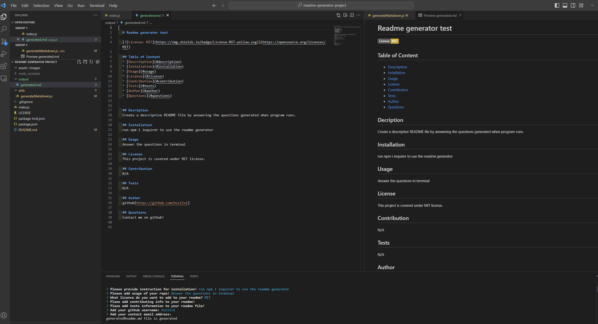

# Module 11 Challenge: Professional README Generator

# Table of content

[Overview](#Overview)
[Screenshots](#Screenshots)
[Links](#Links)
[My_process](#My_process)
[Built_with](#Built_with)
[What_I_learned](#What_I_learned)
[Continued_developement](#Continued_developement)
[Author](#Author)
[Sources](#Sources)

## Overview
Create a readme.md generator that accepts user input from command-line application.   
When a user is prompted for information about the application repository then a high-quality, professional README.md is generated with (title, description, table of contents, installation, usage, licence, contributing, tests and questions)

## Screenshots

[questions in terminal](./assets/images/Screenshot%20missing%20answers.png)

## Video
[show how the readme generator works](https://youtu.be/jEW29kwhwrM)

## Links
the github page of the solution [https://github.com/hszilvi/readme-generator-project]

### Built_with
Javascript, Node, VS code

### What_I_learned
I learned a lot about NODE and its modules.

### Continued_developement
Deeper understanding of node and try/use more modules.

## Author
Szilvia Horvath
GitHub[https://github.com/hszilvi]
LinkedIn[https://www.linkedin.com/in/horvathszilvi/]

### Sources
https://gist.github.com/lukas-h/2a5d00690736b4c3a7ba

